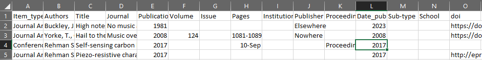

# usmanhnf.github.io
This website can be deployed similar to the native jekyll template website.
Feel free to `fork` it, change according to your needs and deploy in github pages.

## Publications
The publications are extracted in the form of a table from the csv file saved as `references.csv` in `_data` folder. This list can either be downloaded from your google scholar profile or you can update your references in tabular form. A screenshot of the table can be seen in the image below. Further details can be found in my [blogpost](https://usmanhnf.github.io/2023/01/15/first-blog-working-jekyll.html).

The finished publications page can be found [here](https://usmanhnf.github.io/publications/).

For now I am manually adding the years and the publications are sorted out automatically as conference proceedings and the journal article. The years, for now, have to be added manually, forgive my limited knowledge in coding. Furthermore, The `DOI` icon updates automatically if there is any DOI in the `csv` file. When I find time, I will provide the loop and the sorting will be carried out more conveniently.
